# Architecture Documentation

# Vehicle Tracker: Realtime Vehicle Positioning for Developing Countries

**Project:** OneBusAway Vehicle Positions  
**Program:** Google Summer of Code 2026 — Open Transit Software Foundation  
**Repository:** [OneBusAway/vehicle-positions](https://github.com/OneBusAway/vehicle-positions)  
**Primary Technologies:** Go (server), Kotlin/Android (mobile client)

---

## Table of Contents

1. [System Overview](#1-system-overview)
2. [System Requirements](#2-system-requirements)
3. [User Stories / Use Cases](#3-user-stories--use-cases)
4. [High-Level Architecture](#4-high-level-architecture)
5. [Component Architecture](#5-component-architecture)
6. [Data Flow](#6-data-flow)
7. [UML Static Diagrams](#7-uml-static-diagrams)
8. [UML Dynamic Diagrams](#8-uml-dynamic-diagrams)
9. [API Architecture](#9-api-architecture)
10. [Design Patterns](#10-design-patterns)
11. [Deployment Architecture](#11-deployment-architecture)
12. [Software Testing Strategy](#12-software-testing-strategy)
13. [Automated Testing](#13-automated-testing)
14. [Future Architecture Considerations](#14-future-architecture-considerations)

---

## 1. System Overview

### 1.1 Problem Statement

Transit agencies in developing countries — across Africa, South Asia, and Latin America — are increasingly formalising minibus, matatu, tro-tro, and bus rapid transit routes. Many of these agencies have GTFS static feeds (route and schedule data) but **no way to generate GTFS-Realtime feeds** because they lack Automatic Vehicle Location (AVL) hardware. Specialised AVL infrastructure is expensive, complex to operate, and out of reach for agencies with limited budgets.

Meanwhile, drivers in these fleets almost universally carry Android smartphones. Critically, connectivity in these operating environments is **intermittent by design**: strong 4G in city centres gives way to degraded or absent signal on outlying routes. A viable architecture must treat intermittent connectivity not as an edge case, but as the **expected steady state**.

**Vehicle Tracker** bridges this gap. It is a lightweight, open-source system that turns drivers' Android phones into resilient GPS trackers. The Android app implements an **offline-first, write-ahead buffer** strategy: every GPS fix is durably persisted locally before any network transmission is attempted. When connectivity is available, location data is flushed to the Go backend server, which produces standard GTFS-Realtime Vehicle Positions feeds consumable by any compliant transit application — OneBusAway, Transit App, or Google Maps — without modification.

### 1.2 Project Scope

This repository contains the **Go backend server**, the central component of the system. Its responsibilities are strictly bounded to enforce **high cohesion and low coupling** with external systems:

- Accept single-point and batch location reports from authenticated driver apps via a REST API
- Perform idempotent ingestion and deduplication of location data
- Maintain current vehicle state in a thread-safe in-memory store
- Persist full location history to a relational database
- Generate and serve GTFS-Realtime Vehicle Positions protobuf feeds
- Authenticate drivers (JWT) and feed consumers (API keys)
- Provide administrative APIs and a web interface for transit operators

The **Android driver app** (separate repository) is an external client to this server, communicating exclusively through the versioned REST API — a classic **Client-Server architectural boundary**. The **admin interface** is a lightweight web UI bundled with and served by this server.

### 1.3 Architectural Style

The system is designed as a **Layered Architecture** with a strict dependency rule: outer layers depend on inner layers, never the reverse.

```
┌─────────────────────────────────────────┐
│         HTTP / Presentation Layer       │  Handlers, Middleware, Router                        |
├─────────────────────────────────────────┤
│           Service / Domain Layer        │  Tracker, Auth, Feed Generator, Admin               |
├─────────────────────────────────────────┤
│          Data Access / Repository Layer │  Repository interfaces + implementations              |
├─────────────────────────────────────────┤
│            Infrastructure Layer         │  SQLite / PostgreSQL, Protobuf, JWT                 |
└─────────────────────────────────────────┘
```

Each layer exposes a well-defined interface to the layer above it. No layer skips a boundary. This guarantees **low coupling** between concerns and makes each layer independently testable and replaceable.

### 1.4 How It Connects to OneBusAway

The GTFS-RT Vehicle Positions feed produced by this server is a format that OneBusAway already consumes natively. Once deployed, an agency points the feed URL at their OBA server instance — no changes to OBA are required. Vehicle Tracker removes the single largest prerequisite (AVL hardware) that has historically prevented transit agencies in developing countries from deploying OneBusAway.

---

## 2. Requirements Overview

The full Software Requirements Specification for this system is maintained in
[REQUIREMENTS.md](./REQUIREMENTS.md).

This document describes the **system architecture and design decisions** that
enable those requirements to be satisfied.

Only a high-level summary of the most architecturally significant requirements
is included here.

For the complete functional specification, constraints, and rationale, refer to
REQUIREMENTS.md.

---

## 3. User Stories / Use Cases

### 3.1 Driver (Android App User)

| ID | Story |
|----|-------|
| US-D01 | As a driver, I want to authenticate using my registered credentials so that I can securely report vehicle location to the system |
| US-D02 | As a driver, I want to start a trip associated with my assigned vehicle so that my location reports are linked to the correct route and trip |
| US-D03 | As a driver, I want the app to automatically capture and transmit my vehicle’s GPS location during a trip so that passengers and operators can see the vehicle in real time |
| US-D04 | As a driver, I want the app to store location data locally when the network is unavailable so that no tracking data is lost |
| US-D05 | As a driver, I want stored location data to be automatically synchronized when connectivity is restored so that the system receives the full trip history |
| US-D06 | As a driver, I want to end my trip when my route is completed so that the vehicle is removed from the active tracking feed |

### 3.2 Transit Operator (Admin Interface User)

| ID | Story |
|----|-------|
| US-O01 | As an operator, I want to see all active vehicles on a live map so I can monitor fleet status at a glance |
| US-O02 | As an operator, I want to create and manage vehicle records so new buses can be registered in the system |
| US-O03 | As an operator, I want to create driver accounts and assign drivers to vehicles so each location report is correctly attributed |
| US-O04 | As an operator, I want to view trip history and full location trails so I can investigate service issues after the fact |
| US-O05 | As an operator, I want to see the health of the GTFS-RT feed (last update time, active vehicle count, offline queue depth) so I know the data riders are seeing is accurate |
| US-O06 | As an operator, I want to download location data as CSV for offline analysis and reporting |

### 3.3 GTFS-RT Consumer (Transit App / OBA Server)

| ID | Story |
|----|-------|
| US-C01 | As a transit app, I want to poll the GTFS-RT Vehicle Positions endpoint so I can display live vehicle locations to riders |
| US-C02 | As a developer, I want to request the feed in JSON format so I can inspect feed contents without a protobuf decoder |

### 3.4 Use Case Diagram

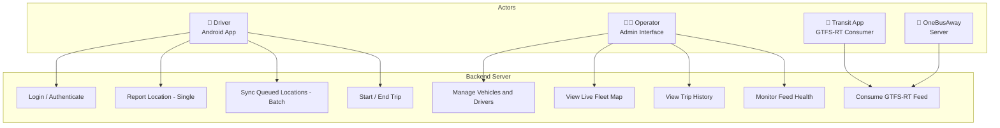

---

## 4. High-Level Architecture

### 4.1 System Context

The Vehicle Tracker system is positioned as a **data production pipeline** within the broader OBA ecosystem: location telemetry flows in from the field via a resilient offline-first Android client, and standards-compliant GTFS-RT feeds flow out to any consumer. The backend server is the authoritative processing and feed-generation hub.

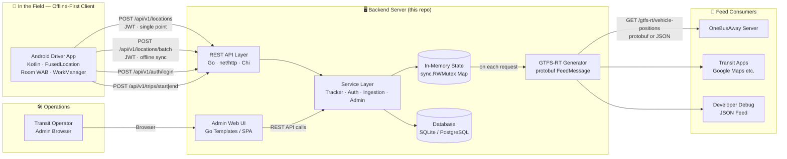

### 4.2 Layered Architecture Summary

The backend adheres to a strict **four-layer architecture**. Dependency always flows downward; no lower layer has any knowledge of the layer above it, ensuring **high cohesion** within each layer and **low coupling** between them.

| Layer | Responsibility | Key Files |
|-------|---------------|-----------|
| **HTTP / Presentation** | Routing, request parsing, response serialisation, middleware chain | `handlers.go`, `main.go` |
| **Service / Domain** | Business logic — location ingestion, deduplication, GTFS-RT assembly, auth, trip lifecycle | `tracker.go` |
| **Data Access / Repository** | Database queries, in-memory state management, Repository interfaces | `store.go` |
| **Infrastructure** | SQLite / PostgreSQL drivers, protobuf bindings, JWT libraries, Docker | `go.mod`, `Dockerfile` |

---

## 5. Component Architecture

### 5.1 Component Overview

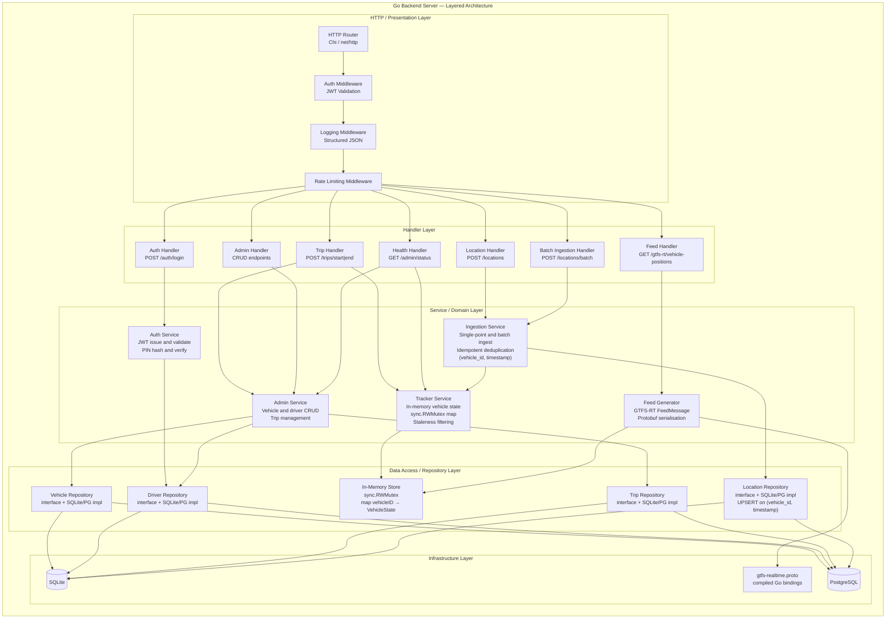

### 5.2 Component Descriptions

#### HTTP Router
The sole entry point for all inbound HTTP traffic. It registers API routes, applies middleware chains, and dispatches requests to the appropriate handler functions. The router is implemented using Go’s net/http package with optional routing support from the Chi router to provide structured route grouping and middleware composition.

#### Auth Middleware
Intercepts requests to protected endpoints and validates the Bearer JWT provided in the Authorization header. If the token is invalid or expired, the middleware immediately returns an HTTP 401 Unauthorized response before handler logic executes. When validation succeeds, the authenticated user identity and role are extracted from the token claims and injected into the request context so downstream handlers can access them.

#### Location Handler
Accepts POST /api/v1/locations requests containing single GPS location reports from the Android driver application during normal connected operation. The handler validates the request payload (required fields, coordinate bounds, and timestamp validity) and forwards the location data to the Ingestion Service for processing.

#### Batch Ingestion Handler
Accepts POST /api/v1/locations/batch requests generated by the Android app during offline synchronization. The handler deserializes an array of timestamped location points and forwards them to the Ingestion Service. The endpoint is designed to safely process repeated submissions of the same payload without producing duplicate records.

#### Ingestion Service
The central service responsible for processing all location data received from driver applications. It validates incoming location points, persists them using the Location Repository, and updates the current vehicle state maintained by the Tracker Service. When processing historical points received through batch synchronization, the service updates the in-memory state only if the incoming timestamp is newer than the vehicle’s current state.

#### Tracker Service
Maintains the real-time state of active vehicles used for feed generation. Vehicle state data (position, trip association, bearing, speed, and last-seen timestamp) is stored in a thread-safe in-memory structure protected by a sync.RWMutex. The service exposes operations for updating vehicle state and retrieving active vehicles for use by the feed generator.

#### Feed Generator
Constructs a GTFS-Realtime FeedMessage representing the current positions of active vehicles. The generator reads vehicle state from the Tracker Service, converts each vehicle record into a VehiclePosition entity, and assembles the final feed response. The feed is serialized to Protocol Buffer format for normal API responses, with optional JSON serialization available for debugging.

#### Auth Service
Encapsulates all authentication-related logic. It validates user credentials against stored password hashes, issues signed JWT tokens upon successful authentication, and provides token validation functionality used by the authentication middleware. The service manages all access to the JWT signing secret, ensuring it is not accessed directly by handlers or repositories.

#### Admin Service
Provides business operations required for system administration, including managing vehicles, drivers, and trip lifecycle records. The service coordinates database interactions through the repository layer and exposes methods used by both administrative API endpoints and the web-based admin interface.

#### Repository Layer
Provides the abstraction layer between application services and the underlying database. Each repository defines an interface for accessing a specific domain entity such as vehicles, drivers, trips, or location records. Concrete implementations support both SQLite and PostgreSQL, allowing the system to switch database backends without modifying service-layer logic.

#### In-Memory Store
Maintains the most recent vehicle state required for generating realtime feeds. The store is implemented as a map of vehicle identifiers to their current state and protected by a sync.RWMutex to support concurrent read and write operations. This design allows feed generation to access vehicle data without performing database queries, ensuring low latency and high throughput.

---

## 6. Data Flow

### 6.1 Online Location Ingestion (Single Point)

```
Android App (connected)
  │
  │  POST /api/v1/locations
  │  Authorization: Bearer <JWT>
  │  Body: { vehicle_id, trip_id, lat, lon, bearing, speed, accuracy, timestamp }
  │
  ▼
Auth Middleware ── JWT invalid ──────────────────────────────────────► 401 Unauthorized
  │
  │  JWT valid; driver identity injected into request context
  ▼
Location Handler
  ├── Validate payload (required fields, coordinate bounds, timestamp range)
  │     └── Invalid ───────────────────────────────────────────────► 400 Bad Request
  │
  ▼
Ingestion Service
  ├── Location Repository → INSERT OR IGNORE ON CONFLICT (vehicle_id, timestamp)
  │     └── Duplicate silently discarded; new point persisted
  │
  ├── Tracker Service → UpdateVehicle (write lock)
  │     └── Update VehicleState only if timestamp > current lastSeen
  │
  └── Release write lock
  │
  ▼
Location Handler ────────────────────────────────────────────────────► 200 OK
```

### 6.2 Offline Sync — Batch Ingestion

This flow is triggered by the Android app's WorkManager task when network connectivity is restored after an outage period.

```
Android App (connectivity restored)
  │
  │  Room WAB contains N unsynchronised location points
  │  WorkManager SyncTask fires
  │
  │  POST /api/v1/locations/batch
  │  Authorization: Bearer <JWT>
  │  Body: {
  │    "points": [
  │      { vehicle_id, trip_id, lat, lon, bearing, speed, timestamp },
  │      ...  (up to N points captured during outage)
  │    ]
  │  }
  │
  ▼
Auth Middleware ── JWT invalid ──────────────────────────────────────► 401 Unauthorized
  │
  │  JWT valid
  ▼
Batch Ingestion Handler
  ├── Deserialise array of LocationPoints
  ├── Validate each point (coordinate bounds, required fields)
  │     └── Any invalid point ─────────────────────────────────────► 400 Bad Request
  │
  ▼
Ingestion Service (iterates over each point)
  ├── For each point:
  │     ├── Location Repository → INSERT OR IGNORE ON CONFLICT (vehicle_id, timestamp)
  │     │     ├── New point → persisted to location_points table
  │     │     └── Duplicate → silently discarded (idempotent)
  │     │
  │     └── Tracker Service → UpdateVehicle
  │           └── Update in-memory VehicleState only if point.timestamp > state.lastSeen
  │               (ensures backfilled historical points do NOT overwrite a fresher live fix)
  │
  ▼
Batch Ingestion Handler ─────────────────────────────────────────────► 200 OK
  │
  ▼
Android App
  └── On 200 OK: marks synced points as synchronised in Room WAB, clears queue
  └── On network failure: WorkManager schedules retry with exponential backoff
```

### 6.3 GTFS-RT Feed Generation

```
Transit App / OBA Server
  │
  │  GET /gtfs-rt/vehicle-positions
  │  (optional) ?format=json
  │
  ▼
Feed Handler
  │
  ▼
Feed Generator
  ├── Tracker Service → ActiveVehicles() [read lock, no DB I/O]
  │     └── snapshot of in-memory map → filter where now − lastSeen ≤ 5m
  │
  ├── Build FeedHeader
  │     └── { gtfs_realtime_version: "2.0", incrementality: FULL_DATASET, timestamp: now }
  │
  ├── For each active VehicleState → Build FeedEntity
  │     └── VehiclePosition {
  │           trip:     { trip_id, route_id, start_time, start_date, SCHEDULED }
  │           position: { latitude, longitude, bearing, speed }
  │           timestamp: lastSeen
  │           vehicle:  { id, label }
  │         }
  │
  ├── proto.Marshal(FeedMessage)  ──► Content-Type: application/x-protobuf  (default)
  └── json.Marshal(FeedMessage)   ──► Content-Type: application/json         (?format=json)
  │
  ▼
Transit App / OBA Server ────────────────────────────────────────────► 200 OK + FeedMessage
```

### 6.4 Driver Authentication Flow

```
Android App
  │
  │  POST /api/v1/auth/login
  │  Body: { email, password }
  │
  ▼
Auth Service
  ├── Driver Repository → FindByEmail(email)
  │     └── Not found ─────────────────────────────────────────────► 401 Unauthorized (Executes dummy bcrypt to prevent timing attacks)
  │
  ├── bcrypt.CompareHashAndPassword(driver.PasswordHash, password)
  │     └── Mismatch ──────────────────────────────────────────────► 401 Unauthorized
  │
  ├── jwt.NewWithClaims({ sub: driverID, email, role: "driver", iss, nbf, exp: +24h })
  │
  └── Return { token, expires_at }
  │
  ▼
Android App ────────────────────────────────────────────────────────► 200 OK + JWT
  └── Stores JWT securely; injects as Bearer token on all subsequent requests
```

---

## 7. UML Static Diagrams

### 7.1 Database Entity Relationship Diagram

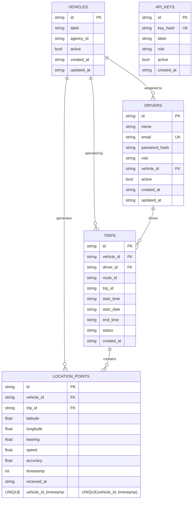

> **Idempotency constraint:** The `UNIQUE(vehicle_id, timestamp)` index on `LOCATION_POINTS` is the database-level enforcement of idempotent ingestion. The Ingestion Service issues `INSERT OR IGNORE` (SQLite) / `INSERT ... ON CONFLICT DO NOTHING` (PostgreSQL), making repeated batch submissions safe under all retry scenarios.

### 7.2 Domain Class Diagram

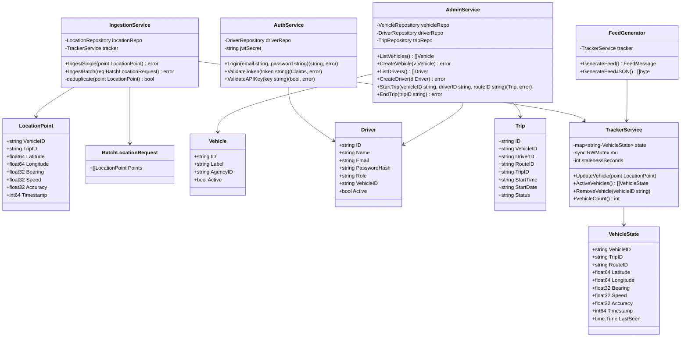

### 7.3 Repository Interface Diagram

The **Repository Pattern** is the architectural mechanism that enforces the boundary between the Service layer and the Infrastructure layer. Each repository is defined as a Go interface; concrete implementations depend on the database engine, never on any service. This achieves **low coupling** between business logic and persistence technology, enabling the database to be swapped at deployment time without altering a single line of service-layer code.

```mermaid
classDiagram
    class LocationRepository {
        <<interface>>
        +Insert(ctx context.Context, p LocationPoint) error
        +InsertBatch(ctx context.Context, points []LocationPoint) error
        +ListByTrip(ctx context.Context, tripID string) ([]LocationPoint, error)
        +ListByVehicle(ctx context.Context, vehicleID string, limit int) ([]LocationPoint, error)
    }

    class VehicleRepository {
        <<interface>>
        +FindByID(ctx context.Context, id string) (Vehicle, error)
        +List(ctx context.Context, activeOnly bool) ([]Vehicle, error)
        +Create(ctx context.Context, v Vehicle) error
        +Update(ctx context.Context, v Vehicle) error
        +Deactivate(ctx context.Context, id string) error
    }

    class DriverRepository {
        <<interface>>
        +FindByID(ctx context.Context, id string) (Driver, error)
        +FindByEmail(ctx context.Context, email string) (Driver, error)
        +List(ctx context.Context, activeOnly bool) ([]Driver, error)
        +Create(ctx context.Context, d Driver) error
        +Update(ctx context.Context, d Driver) error
        +Deactivate(ctx context.Context, id string) error
    }

    class TripRepository {
        <<interface>>
        +FindByID(ctx context.Context, id string) (Trip, error)
        +ListActive(ctx context.Context) ([]Trip, error)
        +ListByVehicle(ctx context.Context, vehicleID string) ([]Trip, error)
        +Create(ctx context.Context, t Trip) error
        +End(ctx context.Context, id string, endTime string) error
    }

    class SQLiteLocationRepository {
        -db *sql.DB
        +Insert() "INSERT OR IGNORE INTO location_points ..."
        +InsertBatch() "BEGIN TRANSACTION · INSERT OR IGNORE × N · COMMIT"
    }

    class PostgresLocationRepository {
        -db *sql.DB
        +Insert() "INSERT INTO location_points ... ON CONFLICT DO NOTHING"
        +InsertBatch() "COPY / INSERT ... ON CONFLICT DO NOTHING"
    }

    LocationRepository <|.. SQLiteLocationRepository : implements
    LocationRepository <|.. PostgresLocationRepository : implements
```

---

## 8. UML Dynamic Diagrams

### 8.1 Sequence Diagram: Driver Login

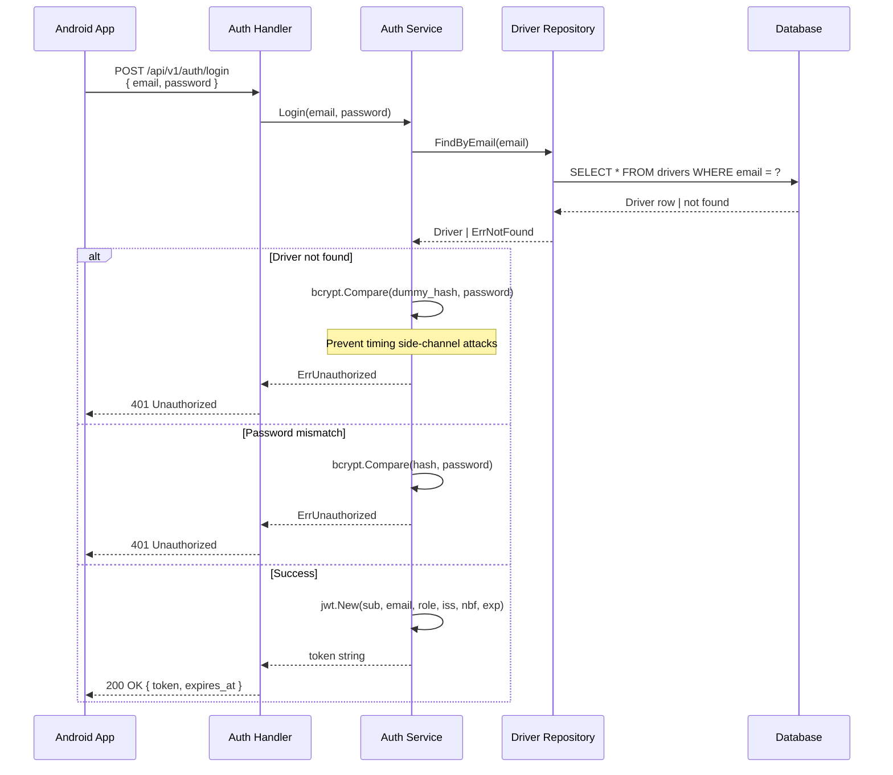

### 8.2 Sequence Diagram: Online Location Ingestion (Single Point)

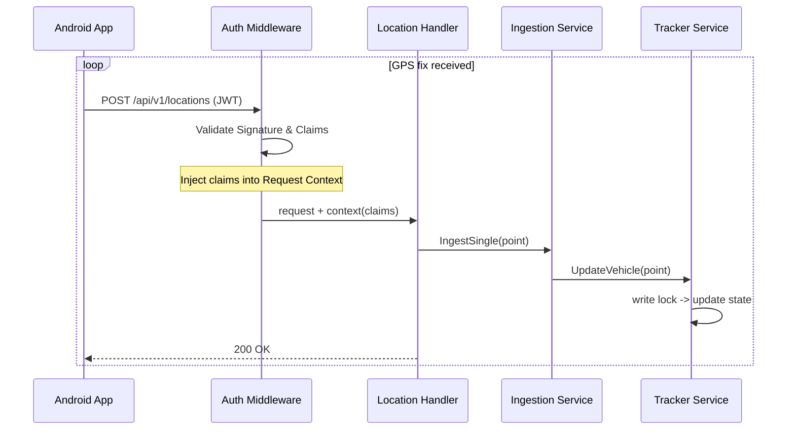

### 8.3 Sequence Diagram: Offline Sync — Batch Ingestion

This diagram shows the complete offline-first lifecycle: GPS fixes captured during an outage, durable local storage via Room WAB, and idempotent batch sync on connectivity restoration.

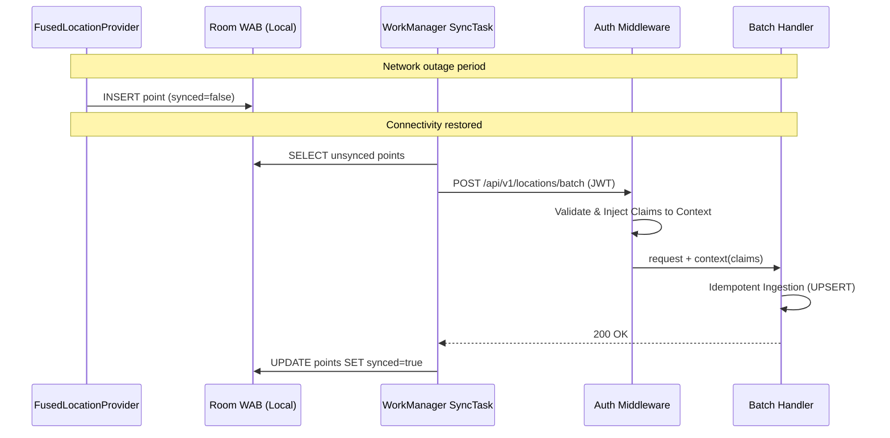

### 8.4 Sequence Diagram: GTFS-RT Feed Request

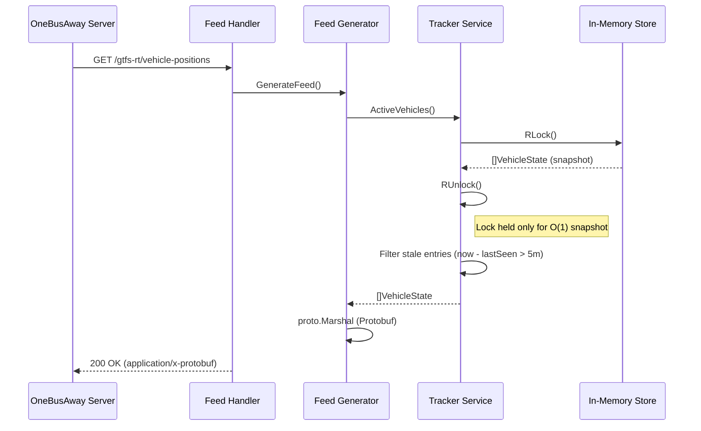

### 8.5 Sequence Diagram: Trip Lifecycle

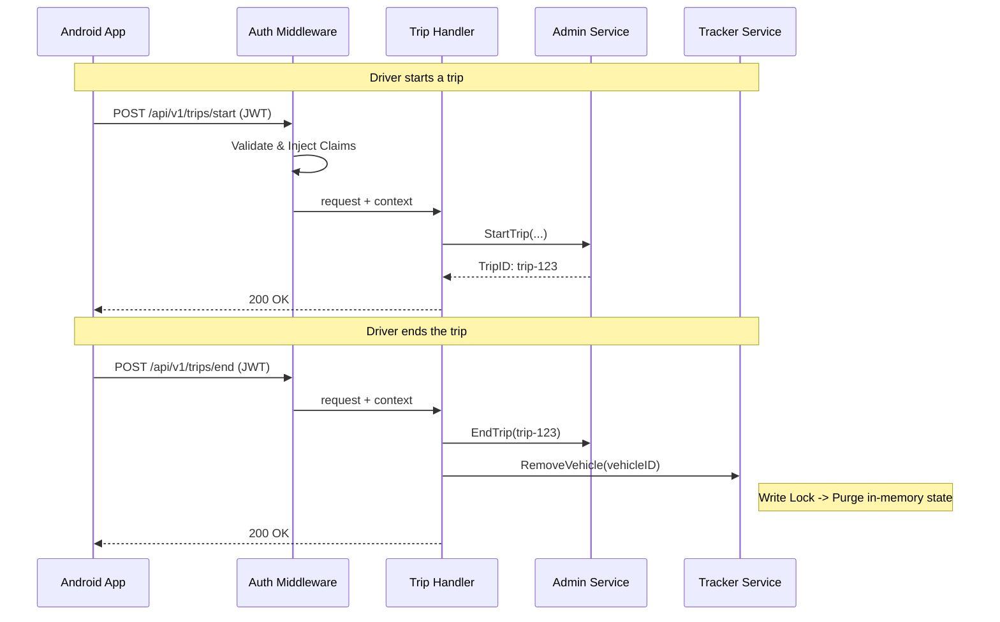

---

## 9. API Architecture

### 9.1 REST API Endpoints

The API follows RESTful conventions and is versioned under `/api/v1`. The **Client-Server architectural boundary** is enforced exclusively through this interface: neither the Android app nor the admin UI has any direct access to the database or in-memory state.

#### Authentication (no auth required)

| Method | Path | Description | Request Body | Response |
|--------|------|-------------|-------------|----------|
| `POST` | `/api/v1/auth/login` | Driver login, issues JWT | `{ email, password }` | `{ token, expires_at }` |

#### Driver Endpoints (Bearer JWT required)

| Method | Path | Description | Request Body | Response |
|--------|------|-------------|-------------|----------|
| `POST` | `/api/v1/locations` | Submit a single GPS fix | See §9.2 | `200 OK` |
| `POST` | `/api/v1/locations/batch` | Submit N queued offline fixes | See §9.3 | `200 OK` |
| `POST` | `/api/v1/trips/start` | Begin a new trip | `{ vehicle_id, route_id, trip_id, start_time, start_date }` | `{ trip_id }` |
| `POST` | `/api/v1/trips/end` | End the current trip | `{ trip_id }` | `200 OK` |

#### GTFS-RT Feed (API key or public, configurable)

| Method | Path | Description | Query Params | Response |
|--------|------|-------------|-------------|----------|
| `GET` | `/gtfs-rt/vehicle-positions` | GTFS-RT Vehicle Positions feed | `?format=json` | Protobuf binary or JSON |

#### Admin Endpoints (admin-scoped JWT required)

| Method | Path | Description |
|--------|------|-------------|
| `GET` | `/api/v1/admin/vehicles` | List all vehicles |
| `POST` | `/api/v1/admin/vehicles` | Create a vehicle |
| `PUT` | `/api/v1/admin/vehicles/:id` | Update a vehicle |
| `DELETE` | `/api/v1/admin/vehicles/:id` | Deactivate a vehicle |
| `GET` | `/api/v1/admin/drivers` | List all drivers |
| `POST` | `/api/v1/admin/drivers` | Create a driver |
| `PUT` | `/api/v1/admin/drivers/:id` | Update a driver |
| `DELETE` | `/api/v1/admin/drivers/:id` | Deactivate a driver |
| `GET` | `/api/v1/admin/trips` | List trips (active and historical) |
| `GET` | `/api/v1/admin/status` | System health and feed statistics |

### 9.2 Single Location Report Payload

```json
{
  "vehicle_id": "vehicle-042",
  "trip_id":    "route_5_0830",
  "latitude":   -1.2921,
  "longitude":  36.8219,
  "bearing":    180.0,
  "speed":      8.5,
  "accuracy":   12.0,
  "timestamp":  1752566400
}
```

| Field | Type | Required | Description |
|-------|------|----------|-------------|
| `vehicle_id` | string | ✅ | Unique vehicle identifier |
| `trip_id` | string | ✅ | Active trip identifier |
| `latitude` | float64 | ✅ | WGS84 latitude (−90 to 90) |
| `longitude` | float64 | ✅ | WGS84 longitude (−180 to 180) |
| `bearing` | float32 | ✅ | Heading in degrees (0–360) |
| `speed` | float32 | ✅ | Speed in m/s |
| `accuracy` | float32 | ❌ | GPS horizontal accuracy in metres |
| `timestamp` | int64 | ✅ | Unix epoch seconds (UTC) — forms the deduplication key with `vehicle_id` |

### 9.3 Batch Location Request Payload

```json
{
  "points": [
    {
      "vehicle_id": "vehicle-042",
      "trip_id":    "route_5_0830",
      "latitude":   -1.2901,
      "longitude":  36.8195,
      "bearing":    175.0,
      "speed":      7.2,
      "accuracy":   15.0,
      "timestamp":  1752566200
    },
    {
      "vehicle_id": "vehicle-042",
      "trip_id":    "route_5_0830",
      "latitude":   -1.2921,
      "longitude":  36.8219,
      "bearing":    180.0,
      "speed":      8.5,
      "accuracy":   12.0,
      "timestamp":  1752566400
    }
  ]
}
```

The server processes each point in `points` through the same idempotent ingestion pipeline as the single-point endpoint. The batch endpoint is designed to be **safe to retry** — submitting the same batch multiple times produces exactly one persisted record per unique `(vehicle_id, timestamp)` pair.

### 9.4 GTFS-RT FeedMessage Structure

```
FeedMessage {
  header {
    gtfs_realtime_version: "2.0"
    incrementality: FULL_DATASET
    timestamp: <unix_epoch_now>
  }
  entity {
    id: "vehicle-042"
    vehicle {
      trip {
        trip_id:               "route_5_0830"
        route_id:              "5"
        start_time:            "08:30:00"
        start_date:            "20260715"
        schedule_relationship: SCHEDULED
      }
      position {
        latitude:  -1.2921
        longitude: 36.8219
        bearing:   180.0
        speed:     8.5
      }
      timestamp: 1752566400
      vehicle {
        id:    "vehicle-042"
        label: "Bus 42"
      }
    }
  }
  // … one entity per active (non-stale) vehicle
}
```

### 9.5 Authentication Architecture

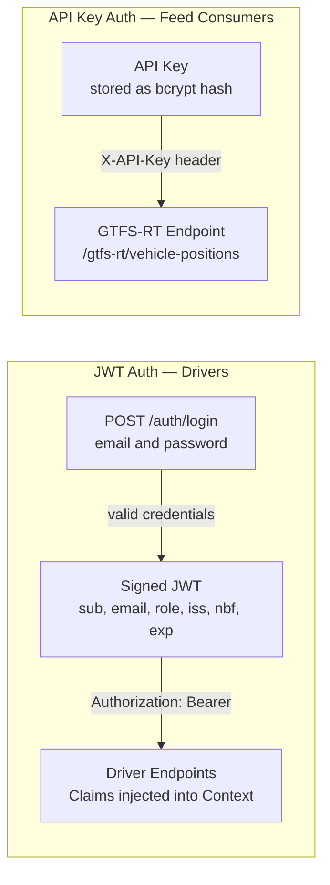

---

## 10. Design Patterns

### 10.1 Repository Pattern

All database access is encapsulated behind Go interfaces. Each domain entity — `Vehicle`, `Driver`, `Trip`, `LocationPoint` — has a dedicated repository interface. Concrete implementations for SQLite and PostgreSQL satisfy the same interface contract. Service-layer code depends exclusively on the interface, never on a concrete implementation.

This pattern is the primary mechanism for achieving **low coupling** between the Service layer and the Infrastructure layer. It also enables complete service-layer unit testing using in-memory fake repositories, with no database process required.

```go
type LocationRepository interface {
    Insert(ctx context.Context, p LocationPoint) error
    InsertBatch(ctx context.Context, points []LocationPoint) error
    ListByTrip(ctx context.Context, tripID string) ([]LocationPoint, error)
    ListByVehicle(ctx context.Context, vehicleID string, limit int) ([]LocationPoint, error)
}
```

### 10.2 Idempotent Ingestion via Conflict-Safe UPSERT

The Ingestion Service and Location Repository together implement an **idempotent write** contract. The `UNIQUE(vehicle_id, timestamp)` database constraint, combined with conflict-safe SQL (`INSERT OR IGNORE` / `ON CONFLICT DO NOTHING`), guarantees that repeated submission of the same location point — whether from a network retry, a WorkManager retry, or a duplicate batch — produces exactly one persisted record with no error surfaced to the caller.

This is the critical correctness guarantee that makes offline batch sync safe to implement with simple retry logic on the client side.

```go
// LocationRepository logic ensures idempotency. 
// SQLite uses "INSERT OR IGNORE"
// PostgreSQL uses "INSERT ... ON CONFLICT (vehicle_id, timestamp) DO NOTHING"
func (r *SQLiteLocationRepository) InsertBatch(ctx context.Context, points []LocationPoint) error {
    tx, _ := r.db.BeginTx(ctx, nil)
    stmt, _ := tx.PrepareContext(ctx,
        `INSERT OR IGNORE INTO location_points
         (vehicle_id, trip_id, latitude, longitude, bearing, speed, accuracy, timestamp, received_at)
         VALUES (?, ?, ?, ?, ?, ?, ?, ?, ?)`)
    for _, p := range points {
        stmt.ExecContext(ctx, p.VehicleID, p.TripID, p.Latitude, p.Longitude,
            p.Bearing, p.Speed, p.Accuracy, p.Timestamp, time.Now().UTC())
    }
    return tx.Commit()
}
```

### 10.3 Middleware Chain Pattern

HTTP middleware is composed as a linear chain of higher-order functions, each responsible for a single cross-cutting concern — authentication, structured logging, or rate limiting. Each middleware either passes control to `next` (proceed) or short-circuits the chain with an error response (reject). Handlers receive only validated, authenticated requests with a fully-populated request context.

```
Inbound Request
  → [Rate Limiter]    — reject if request budget exceeded
  → [Structured Logger] — record method, path, latency
  → [Auth Validator]  — validate JWT; inject claims into context
  → [Handler]         — execute business logic
  → Response
```

This pattern enforces **high cohesion** within each middleware (one concern only) and **low coupling** between middlewares (each is unaware of the others).

### 10.4 In-Memory Write-Through State

The `TrackerService` maintains a `sync.RWMutex`-protected map as the **primary read path** for live vehicle positions, backed by the database as the durable write path. Every location ingestion writes to both the in-memory map (write lock, microseconds) and the database (via the Location Repository). Feed generation reads exclusively from the in-memory map (read lock, no database I/O), ensuring that feed endpoint latency is constant and independent of database load.

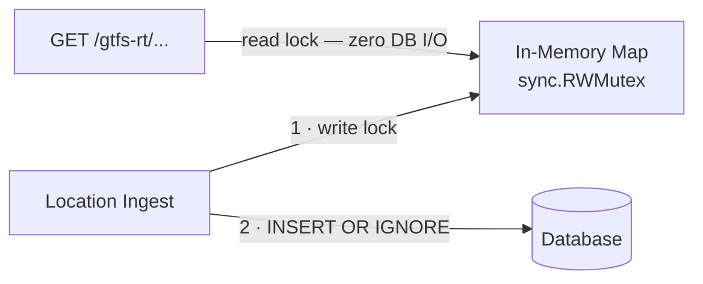

The Ingestion Service applies an additional rule when updating the in-memory map from a batch sync: a backfilled historical point updates the map **only if its timestamp is strictly greater than the vehicle's current `lastSeen`**. This guarantees that a late-arriving batch of stale points from an outage period never overwrites a fresher live fix that arrived while the sync was in flight.

### 10.5 Offline-First Write-Ahead Buffer (Android Client)

The Android app implements an **offline-first** strategy using a Room local database as a write-ahead buffer (WAB). Every GPS fix is written to the WAB before any network transmission is attempted. A WorkManager periodic task monitors the WAB for unsynced points and, when network connectivity is detected, submits them to `POST /api/v1/locations/batch`. On a confirmed `200 OK`, the task marks those points as synced and clears them from the WAB.

```
GPS Fix
  ↓
Room WAB (INSERT, synced=false)        ← durable, survives app kill / device reboot
  ↓
WorkManager SyncTask (on connectivity)
  ↓
POST /api/v1/locations/batch            ← idempotent; safe to retry on failure
  ↓
200 OK
  ↓
Room WAB (UPDATE synced=true)          ← queue cleared
```

This pattern decouples location capture from network availability, ensuring **zero location data loss** during connectivity outages of any duration.

### 10.6 Service Layer Separation

Business logic is entirely confined to service structs, never to handlers or repositories. Handlers are intentionally thin: parse the request, call one service method, serialise the response. This strict three-tier separation — `Handler → Service → Repository` — is the structural expression of the **high cohesion** principle: each type does one thing and has one reason to change.

### 10.7 Dependency Injection via Constructor

All services and handlers receive their dependencies — repositories, collaborating services, configuration values — exclusively through constructor functions. No component uses package-level global variables. This makes the dependency graph explicit, the wiring visible in `main.go`, and every component independently unit-testable.

```go
func NewIngestionService(
    locationRepo LocationRepository,
    tracker      *TrackerService,
) *IngestionService {
    return &IngestionService{
        locationRepo: locationRepo,
        tracker:      tracker,
    }
}
```

### 10.8 12-Factor Configuration

All runtime configuration — `DATABASE_URL`, `JWT_SECRET`, `PORT`, `STALENESS_SECONDS` — is supplied exclusively via environment variables, per [12-Factor App](https://12factor.net/) methodology. This makes the server binary identical across local development, Docker, and production, with behaviour varied only through the environment.

---

## 11. Deployment Architecture

### 11.1 Small / Development Deployment

The simplest deployment targets a single host using `docker-compose` with SQLite. Suitable for agencies with fleets under approximately 30 vehicles, or for development and CI environments.

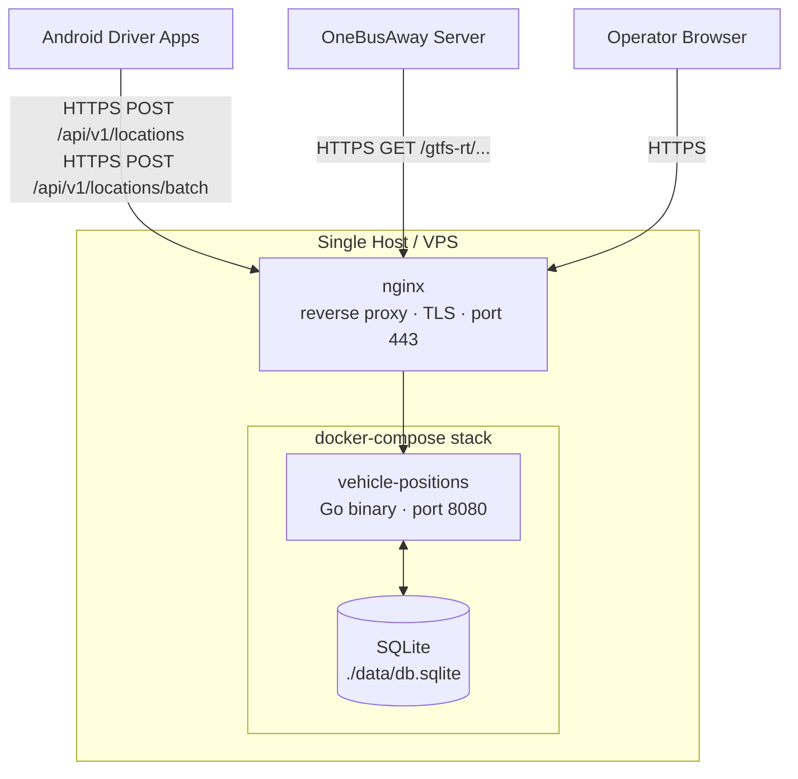

**docker-compose.yml (representative):**

```yaml
services:
  vehicle-positions:
    image: ghcr.io/onebusaway/vehicle-positions:latest
    ports:
      - "8080:8080"
    environment:
      DATABASE_URL:       "file:/data/db.sqlite"
      JWT_SECRET:         "${JWT_SECRET}"
      STALENESS_SECONDS:  "300"
    volumes:
      - ./data:/data
    restart: unless-stopped
```

### 11.2 Production Deployment (PostgreSQL)

For production deployments or larger fleets, PostgreSQL replaces SQLite. The
server binary remains unchanged; only the `DATABASE_URL` environment variable
differs.

The initial deployment model assumes a **single backend instance**, which is
sufficient for the expected fleet sizes (tens of vehicles reporting every
10–30 seconds). Feed generation relies on an in-memory state store for
low-latency access to the most recent vehicle positions.

Horizontal scaling with multiple instances behind a load balancer is not part
of the initial deployment model, because each instance maintains its own
in-memory vehicle state. Future versions of the system could support
multi-instance deployments using a shared state layer (e.g., Redis) or a
message bus to synchronize vehicle updates across instances.

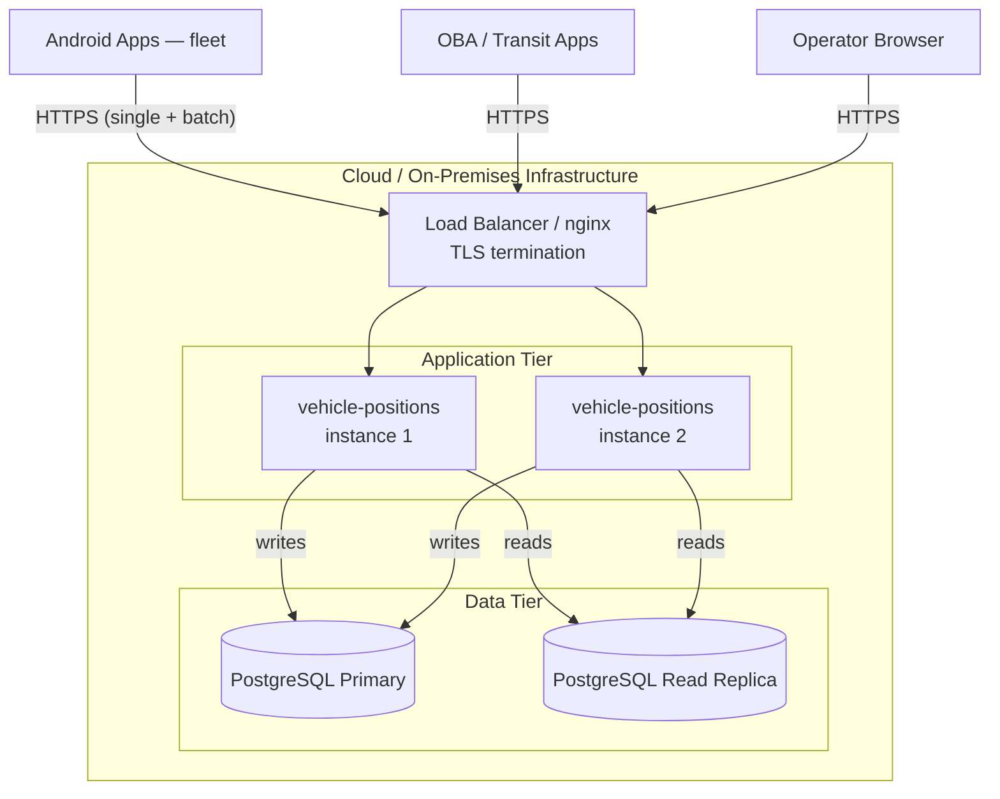

### 11.3 CI/CD Pipeline

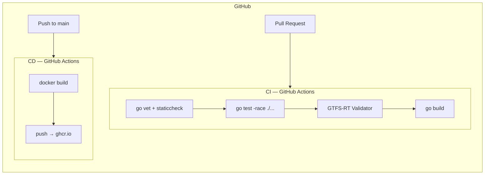

---

## 12. Software Testing Strategy

### 12.1 Testing Pyramid

```
          ╔═══════════════╗
          ║  End-to-End   ║   ← Multi-vehicle simulation; full feed validation
          ╚═══════════════╝
        ╔═══════════════════╗
        ║   Integration     ║   ← HTTP handler tests; real SQLite; batch sync flows
        ╚═══════════════════╝
      ╔═══════════════════════╗
      ║      Unit Tests       ║   ← Services; repositories (fake); feed generator
      ╚═══════════════════════╝
```

The **Repository Pattern** is what makes this pyramid practical: unit tests for the Ingestion Service, Tracker Service, and Feed Generator use in-memory fake implementations of repository interfaces — no database process, no I/O, sub-millisecond execution.

### 12.2 Unit Tests

**Ingestion Service (`tracker_test.go`):**
- `IngestSingle` persists a new point and updates in-memory state
- `IngestBatch` processes N points; each is persisted and state updated
- `IngestBatch` with a duplicate `(vehicle_id, timestamp)` produces exactly one DB record
- `IngestBatch` does not overwrite in-memory state with an older timestamp than the current state
- Concurrent calls to `IngestSingle` and `ActiveVehicles` produce no data races (run with `-race`)

**Tracker Service:**
- `ActiveVehicles` excludes entries where `now − lastSeen > stalenessThreshold`
- `ActiveVehicles` includes entries within the threshold
- `RemoveVehicle` removes the vehicle from the map atomically

**Feed Generator:**
- Zero active vehicles → valid `FeedMessage` with empty entity list
- N active vehicles → exactly N `FeedEntity` records
- Each entity's `VehiclePosition` fields match the source `VehicleState` exactly
- `proto.Marshal` → `proto.Unmarshal` round-trip produces identical struct

**Auth Service:**
- Valid credentials → signed JWT with correct `sub`, `role`, and `exp` claims
- Invalid PIN → `ErrUnauthorized`
- Unknown phone → `ErrUnauthorized`
- Expired token → validation failure
- Tampered token signature → validation failure

### 12.3 Integration Tests

Integration tests (`handlers_test.go`, `store_test.go`) exercise the full HTTP stack against a real in-process SQLite database.

**Handler integration tests (`handlers_test.go`):**
- `POST /api/v1/auth/login` with valid credentials → `200` + JWT
- `POST /api/v1/locations` with valid JWT → `200`; subsequent feed request contains the vehicle
- `POST /api/v1/locations` with expired JWT → `401`
- `POST /api/v1/locations` with missing required field → `400`
- `POST /api/v1/locations/batch` with N points → `200`; all N points persisted; no duplicates on repeat submission
- `POST /api/v1/locations/batch` submitted twice with identical payload → `200` both times; DB contains exactly N records
- `GET /gtfs-rt/vehicle-positions` → valid protobuf feed containing submitted vehicles
- `GET /gtfs-rt/vehicle-positions?format=json` → valid JSON

**Store integration tests (`store_test.go`):**
- `Insert` + `ListByTrip` → inserted point is returned
- `InsertBatch` + repeated `InsertBatch` with same data → exactly one record per `(vehicle_id, timestamp)` pair
- `ListByVehicle` with `limit` → result set is capped correctly
- Repository returns `ErrNotFound` for unknown identifiers

### 12.4 GTFS-RT Feed Validation

Feed compliance is validated in CI against the [MobilityData GTFS-RT Validator](https://github.com/MobilityData/gtfs-realtime-validator):

1. Start the server with pre-loaded test fixtures (vehicles, drivers, trips)
2. Submit a set of location points to populate in-memory state
3. Fetch `GET /gtfs-rt/vehicle-positions`
4. Write the protobuf binary to a temporary file
5. Execute the GTFS-RT Validator CLI against the output
6. Assert **zero errors** and **zero warnings**

This gate ensures the feed is specification-compliant and can be consumed without modification by any conformant GTFS-RT client, including OneBusAway.

### 12.5 Offline Sync Tests

A dedicated test suite validates the correctness of the offline batch ingestion path:

- Submit 50 location points to `POST /api/v1/locations/batch`; verify 50 records in database
- Submit the same 50 points again; verify still exactly 50 records (idempotency)
- Submit a batch with a mix of new and already-seen points; verify only net-new points added
- Submit a batch containing a point with an older timestamp than the vehicle's current in-memory state; verify in-memory state is not regressed

### 12.6 Stress Testing

A vehicle simulator generates realistic GPS traces along GTFS route shapes and issues concurrent HTTP requests, replicating a full active fleet. The stress test validates:

- 50+ simultaneous vehicles reporting at 10-second intervals sustain sub-second feed generation latency
- Memory usage is stable over 30-minute runs (no in-memory store leak)
- Batch sync of 500 queued points completes within acceptable time bounds
- The GTFS-RT feed remains specification-valid throughout

---

## 13. Automated Testing

### 13.1 GitHub Actions CI Workflow

The CI pipeline executes on every pull request and every push to `main`. All checks must pass before a pull request may be merged.

```yaml
# .github/workflows/ci.yml

name: CI

on:
  push:
    branches: [main]
  pull_request:

jobs:
  test:
    runs-on: ubuntu-latest
    steps:
      - uses: actions/checkout@v4

      - name: Set up Go
        uses: actions/setup-go@v5
        with:
          go-version: "1.22"

      - name: Install dependencies
        run: go mod download

      - name: Format check
        run: test -z "$(gofmt -l .)"

      - name: Lint (go vet)
        run: go vet ./...

      - name: Static analysis (staticcheck)
        run: |
          go install honnef.co/go/tools/cmd/staticcheck@latest
          staticcheck ./...

      - name: Run tests with race detector
        run: go test -race -coverprofile=coverage.out ./...

      - name: Upload coverage
        uses: codecov/codecov-action@v4
        with:
          files: coverage.out

      - name: Build binary
        run: go build -o vehicle-positions ./...

      - name: Validate GTFS-RT feed
        run: |
          ./vehicle-positions &
          sleep 2
          # Load test fixtures, submit location points, fetch feed
          # Run MobilityData GTFS-RT Validator CLI
          # Assert zero errors and zero warnings

      - name: Build Docker image
        run: docker build -t vehicle-positions:ci .
```

### 13.2 CI Checks Summary

| Check | Tool | Failure Condition |
|-------|------|-------------------|
| Code formatting | `gofmt` | Any file not correctly formatted |
| Static analysis | `go vet`, `staticcheck` | Any reported diagnostic |
| Unit + integration tests | `go test -race` | Any test failure or detected data race |
| Batch idempotency tests | `go test -race` | Any duplicate record or state regression |
| Code coverage | `codecov` | Coverage falls below configured threshold |
| Binary compilation | `go build` | Any compilation error |
| GTFS-RT feed validity | MobilityData validator | Any error or warning |
| Docker image build | `docker build` | Build failure |

### 13.3 CD Workflow

On successful merge to `main`, a separate workflow builds and publishes the production Docker image to the GitHub Container Registry.

```yaml
name: CD

on:
  push:
    branches: [main]

jobs:
  docker:
    runs-on: ubuntu-latest
    steps:
      - uses: actions/checkout@v4

      - name: Log in to GitHub Container Registry
        uses: docker/login-action@v3
        with:
          registry: ghcr.io
          username: ${{ github.actor }}
          password: ${{ secrets.GITHUB_TOKEN }}

      - name: Build and push Docker image
        uses: docker/build-push-action@v5
        with:
          push: true
          tags: |
            ghcr.io/onebusaway/vehicle-positions:latest
            ghcr.io/onebusaway/vehicle-positions:${{ github.sha }}
```

---

## 14. Future Architecture Considerations

### 14.1 Arrival Prediction — GTFS-RT TripUpdates

The current system produces Vehicle Positions feeds, which tell riders *where* a vehicle is. The logical next layer is GTFS-RT TripUpdate feeds, which tell riders *when it will arrive*.

A `PredictionService` can be introduced as a domain service within the existing Layered Architecture. It consumes the historical `location_points` table — which accumulates travel-time data automatically as the system operates — to compute per-route, per-stop arrival estimates. These estimates are materialised as GTFS-RT `TripUpdate` messages and served from a new feed endpoint. The database schema is already designed to support this: every point is timestamped and linked to a `trip_id`.

### 14.2 Multi-Agency Support

The current schema and service layer assume a single tenant. Adding an `agency_id` column to `VEHICLES`, `DRIVERS`, `TRIPS`, and `LOCATION_POINTS`, and propagating it as a mandatory filter through all Repository queries, enables a single server instance to serve multiple transit agencies in strict isolation. API keys and admin JWTs are scoped to an `agency_id`. The GTFS-RT endpoint becomes:

```
GET /gtfs-rt/{agency_id}/vehicle-positions
```

The Feed Generator and in-memory state map are partitioned by `agency_id`. No changes to the core feed generation logic are required.

### 14.3 Operator Push Alerts via WebSocket / SSE

The current admin interface operates on a polling model. A WebSocket or Server-Sent Events (SSE) endpoint would enable the server to push low-latency alerts to operators when:

- A vehicle has not reported within a configurable idle threshold
- A vehicle deviates beyond a geofence boundary around its assigned route
- A driver's token expires while an active trip is in progress
- The GTFS-RT feed has not been refreshed within the staleness window

This can be implemented as an `AlertService` that subscribes to events emitted by the `TrackerService` via a Go channel — an internal publish-subscribe mechanism requiring no external message broker.

### 14.4 Integration with The Transit Clock

The GTFS-RT Vehicle Positions feed produced by this server is a valid input to [The Transit Clock](https://github.com/TheTransitClock/transitclock), an open-source arrival prediction engine that applies historical pattern matching. Agencies that deploy both systems gain statistically-informed arrival estimates without any modifications to this server.

### 14.5 OBACloud Managed Offering

Vehicle Tracker is architected as a self-contained, independently deployable service. A future OBACloud hosted offering would allow agencies to consume the system as a managed service — directing the Android app at a shared endpoint and receiving a GTFS-RT feed URL in return — removing the operational burden of running server infrastructure. The existing JWT + API key authentication model and versioned REST API are already well-suited to a multi-tenant SaaS model with the addition of the `agency_id` isolation described above.

---

## Appendix A: Glossary

| Term | Definition |
|------|-----------|
| **AVL** | Automatic Vehicle Location — specialised hardware installed in transit vehicles to broadcast position. Vehicle Tracker replaces the need for AVL in agencies that lack it. |
| **GTFS** | General Transit Feed Specification — the standard format for transit schedule data (routes, stops, trips, fares). |
| **GTFS-RT** | GTFS-Realtime — an extension of GTFS for live data: vehicle positions, trip updates, and service alerts. Encoded as Protocol Buffers. |
| **FeedMessage** | The top-level protobuf message in a GTFS-RT feed. Contains a `FeedHeader` and a list of `FeedEntity` records. |
| **VehiclePosition** | A GTFS-RT message type describing the current position of a transit vehicle on a trip. |
| **Write-Ahead Buffer (WAB)** | A local Room database on the Android device that durably stores GPS fixes before transmission. Guarantees zero data loss during network outages. |
| **Idempotent Ingestion** | A property of the batch endpoint: submitting the same payload multiple times produces exactly one persisted record per unique `(vehicle_id, timestamp)` pair. |
| **JWT** | JSON Web Token — a compact, signed, self-contained token used for stateless authentication. |
| **FusedLocationProviderClient** | Android's sensor-fusion location API combining GPS, Wi-Fi, and cellular data for accuracy and battery efficiency. |
| **OBA** | OneBusAway — the open-source transit rider information platform that natively consumes GTFS-RT feeds. |
| **OTSF** | Open Transit Software Foundation — the non-profit organisation that stewards OneBusAway and related open transit software. |
| **Matatu / Tro-tro** | Informal shared minibus vehicles common in East Africa and West Africa respectively, increasingly operating on formalised fixed routes. |

## Appendix B: References

- [GTFS-RT Specification](https://gtfs.org/documentation/realtime/proto/)
- [GTFS-RT Validator — MobilityData](https://github.com/MobilityData/gtfs-realtime-validator)
- [gtfs-realtime-bindings for Go](https://github.com/MobilityData/gtfs-realtime-bindings)
- [Maglev — OneBusAway next-generation Go server](https://github.com/OneBusAway/maglev)
- [OneBusAway Android app](https://github.com/OneBusAway/onebusaway-android)
- [Android Foreground Services](https://developer.android.com/develop/background-work/services/foreground-services)
- [Android WorkManager](https://developer.android.com/topic/libraries/architecture/workmanager)
- [Android Room Persistence Library](https://developer.android.com/training/data-storage/room)
- [Don't Kill My App — OEM battery optimisation reference](https://dontkillmyapp.com)
- [The 12-Factor App](https://12factor.net/)

---

*This document is part of the OneBusAway Vehicle Positions project maintained by the Open Transit Software Foundation.*